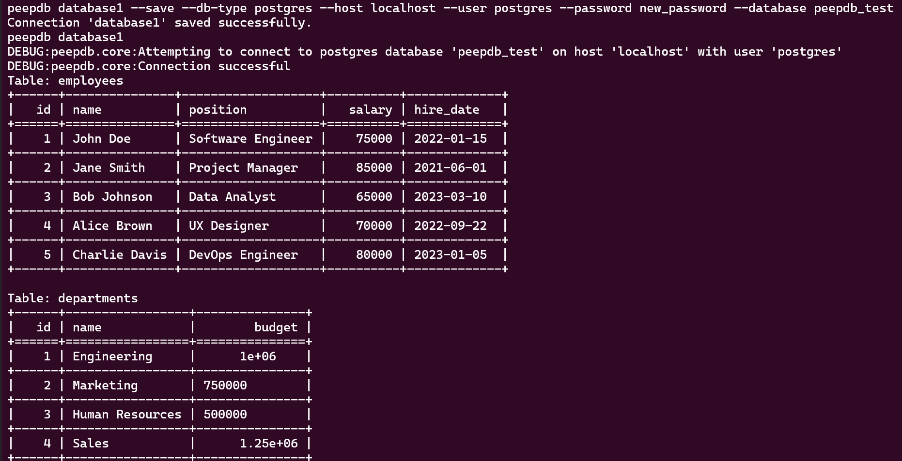

# peepDB

**peepDB** is an open-source command-line tool and Python library designed for developers and database administrators who need a fast and efficient way to inspect their database tables without writing SQL queries. With support for MySQL, PostgreSQL, and MariaDB, peepDB is lightweight, secure, and incredibly easy to use.

## 🚀 Features

- **Multi-Database Support**: Works with MySQL, PostgreSQL, and MariaDB.
- **Quick Data Inspection**: View all tables or a specific table with a simple command.
- **User-Friendly CLI**: Easy-to-use command-line interface.
- **Secure Storage**: Securely store database connection details with encryption.
- **Lightweight**: Minimal footprint, designed for speed.
- **Formatted Output**: View data in a clean, formatted table or JSON format.



## 📦 Installation

You can install peepDB directly from PyPI:

```bash
pip install peepdb
```

**Requirements:**
- Python 3.6 or higher
- pip (Python package installer)

> **Note:** If peepdb gives an error like "The term 'peepdb' is not recognized as the name of a cmdlet" remember to add the Python Scripts folder to your PATH in Windows.

## System Dependencies

Before installing peepdb, ensure you have the following system dependencies:

```bash
sudo apt-get update
sudo apt-get install libmariadb3 libmariadb-dev
```

Verify the installation by running:
```bash
peepdb --version
```

## 🛠️ Usage

### For Users

#### 1. Save Your Database Connection Details (Optional)

```bash
peepdb <connection_name> --save --db-type [mysql/postgres/mariadb] --host <host> --user <user> --password <password> --database <database>
```

#### 2. List Saved Connections

```bash
peepdb --list
```

#### 3. View All Tables or a Specific Table

View all tables:
```bash
peepdb <connection_name>
```

View a specific table:
```bash
peepdb <connection_name> --table <table_name>
```

#### 4. Choose Output Format

Get output in JSON format:
```bash
peepdb <connection_name> --format json
```

#### 5. Remove Saved Connections

Remove a specific connection:
```bash
peepdb --remove <connection_name>
```

Remove all connections:
```bash
peepdb --remove-all
```

### Examples

1. **Save MySQL connection details:**
   ```bash
   peepdb myapp_db --save --db-type mysql --host localhost --user root --password mypassword --database myapp
   ```

2. **View all tables in the saved MySQL database:**
   ```bash
   peepdb myapp_db
   ```

3. **View a specific table:**
   ```bash
   peepdb myapp_db --table users
   ```

4. **Get output in JSON format:**
   ```bash
   peepdb myapp_db --format json
   ```

For more detailed usage information, run:
```bash
peepdb --help
```

## 👨‍💻 For Developers

### Project Structure

```
peepdb/
├── peepdb/
│   ├── __init__.py
│   ├── cli.py
│   ├── core.py
│   └── config.py
├── tests/
│   ├── __init__.py
│   ├── test_cli.py
│   ├── test_connection.py
│   ├── test_data_types.py
│   └── test_peepdb.py
├── setup.py
└── pyproject.toml
```

### Setting Up Development Environment

1. Clone the repository:
   ```bash
   git clone https://github.com/yourusername/peepdb.git
   cd peepdb
   ```

2. Create a virtual environment:
   ```bash
   python -m venv venv
   source venv/bin/activate  # On Windows: venv\Scripts\activate
   ```

3. Install the package in editable mode with development dependencies:
   ```bash
   pip install -e .[dev]
   ```

### Running Tests

Run the test suite using pytest:

```bash
pytest
```

### Code Style

We follow PEP 8 guidelines. You can use tools like `flake8` or `black` to ensure your code adheres to the style guide.

## 🤝 Contributing

Contributions are welcome! Please feel free to submit a Pull Request.

1. Fork the repository
2. Create your feature branch (`git checkout -b feature/AmazingFeature`)
3. Commit your changes (`git commit -m 'Add some AmazingFeature'`)
4. Push to the branch (`git push origin feature/AmazingFeature`)
5. Open a Pull Request

For more details, please read our [Contributing Guide](CONTRIBUTING.md).

## 🔒 Security

peepDB uses encryption to securely store database connection details. The encryption key is stored in your user directory (~/.peepdb/key.key). Keep this key safe and do not share it.

## 📜 License

Distributed under the GNU General Public License Version 3. See the [LICENSE](LICENSE) file for more details.

## 📚 Documentation

For more detailed documentation, please visit our [GitHub Pages](https://peepdb.dev/).

